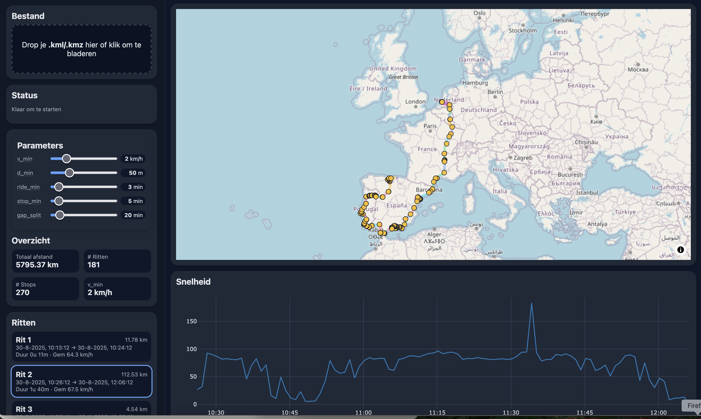

# KMZ / KML Viewer & Analyzer

Interactievere viewer/analyzer voor GPS-tracks uit **KML/KMZ**.
Alles draait **100% in de browser** (privacy-vriendelijk, geen upload).
Visualiseert de track op de kaart, detecteert **ritten** en **stilstanden**, en tekent per rit een **snelheid–tijd** grafiek.
Drempels zijn **live instelbaar** via sliders (v\_min, d\_min, min. rit-/stopduur, gap-split).



---

## Features

* **Bestanden**: KML **en** KMZ (KMZ wordt client-side uitgepakt).
* **Parsing**:

  * Ondersteunt `gx:Track` (aanbevolen in KML met tijdstempels).
  * Fallback voor `LineString` (zonder `<when>`): synthetische 60s intervallen.
* **Analyse**:

  * Snelheid (km/h) en afstand (Haversine) tussen punten.
  * **Ritten**: segmenten met beweging boven drempels.
  * **Stilstanden**: cluster van punten met minimale duur; centroid & radius.
  * **Totaalafstand** over de hele dataset.
* **Visualisatie**:

  * Kaart met **MapLibre GL** (OSM tiles), ritten in kleur, stops als punten.
  * **Klik** een rit → snelheid–tijd grafiek (**Plotly GPU/scattergl**).
* **Parameters (live)**:

  * `v_min` (km/h), `d_min` (m), `ride_min` (min), `stop_min` (min), `gap_split` (min).
  * Wijzigingen **reanalyseren automatisch** (debounced).
* **Performance**:

  * Parsing & analyse in **Web Worker** – UI blijft soepel.

---

## Stack

* **ChatGPT**
* **Vite + React (TypeScript)**
* **MapLibre GL JS** (kaarten)
* **Plotly.js** (grafieken, WebGL)
* **JSZip** (KMZ unzip)
* Eigen **segmentatie**-logica (zie “Detectie-algoritme”)

---

## Snel starten

### Vereisten

* Node.js (LTS) + npm
  Tip (macOS): `brew install nvm && nvm install --lts`

### Install & run

```bash
npm install
npm run dev
```

Open de lokale URL die Vite toont.

### Build (productie)

```bash
npm run build
npm run preview    # lokaal testen van /dist
```

---

## Gebruik

1. Start de app en **drop** een `.kml` of `.kmz` bestand (of klik om te kiezen).
2. De kaart zoomt op de track. Links zie je **Ritten** met afstand, duur, gem. snelheid.
3. Klik een rit → **snelheid–tijd** grafiek onder de kaart.
4. Pas **Parameters** aan (tooltips leggen uit wat elke slider doet); de analyse draait direct opnieuw.

---

## Detectie-algoritme (kort)

* **Snelheid/afstand**: per puntpaar via Haversine; snelheid = Δafstand/Δtijd.
* **Beweging** (moving): `speed > v_min` **of** `distance > d_min`.
* **Ritten**: aaneengesloten moving-segmenten met duur ≥ `ride_min`.
* **Stilstanden**: aaneengesloten non-moving segmenten met duur ≥ `stop_min`; geclusterd tot één stop met centroid en radius.
* **Datagaten**: als Δtijd tussen punten > `gap_split`, dan *hard split* (segmentgrens).

### Default drempels

* `v_min = 2 km/h`, `d_min = 50 m`, `ride_min = 3 min`, `stop_min = 5 min`, `gap_split = 20 min`
  (Allemaal in de UI te tunen.)

---

## Projectstructuur (beknopt)

```
src/
  App.tsx                  # UI, worker-bridge, state
  components/
    Dropzone.tsx           # bestand kiezen/drop
    MapView.tsx            # MapLibre-kaart, rit-/stop-layers
    SpeedChart.tsx         # Plotly snelheid–tijd
    ParamControls.tsx      # sliders + tooltips + value pills
  lib/
    geo.ts                 # Haversine, bbox
    segmentation.ts        # rit-/stop-detectie + totalen
  worker/
    trackWorker.ts         # KMZ/KML parsing, analyse in worker
  types.ts                 # Types voor punten/ritten/stops/params
styles.css                 # Thema + layout
```

---

## Privacy

* Bestanden worden **niet** geüpload; parsing/analyse gebeurt **lokaal** in je browser.
* Je kunt de app statisch hosten (GitHub Pages, Netlify, Vercel) zonder server/backend.

---

## Troubleshooting

* **“Geen .kml gevonden in KMZ”**: je KMZ bevat geen KML op toplevel; exporteer opnieuw of open de KML direct.
* **Track zonder `<when>`**: `LineString`-fallback gebruikt 60s per punt; tijd-as is dan synthetisch.
* **Trage grafiek bij grote ritten**: verlaag `ride_min`/`v_min` of overweeg downsampling (zie Roadmap).
* **Niks gebeurt na slider**: check in de console of de worker-melding binnenkomt; de UI triggert een debounced re-analyze.

---

## Roadmap / ideeën

* CSV/GeoJSON export (rittenoverzicht / lijnen + stop-punten).
* Downsampling (LTTB) voor grafiek en kaart op zeer lange ritten.
* Outlier-filter (max km/h, max afstand per minuut).
* Datumfilters, maand-/weekstatistieken.
* (Optioneel) Reverse geocoding voor stop-naam (client-side, rate-limited).

---

## Dank

ChatGPT, OpenStreetMap contributors (tiles), MapLibre GL, Plotly.js, JSZip.
